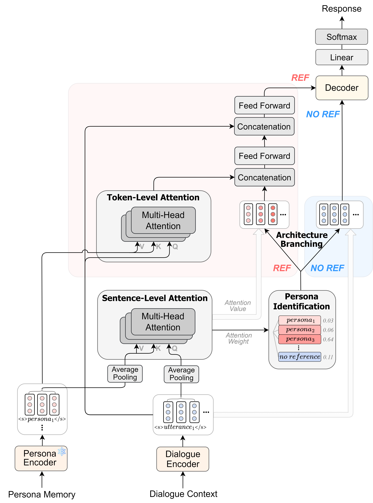
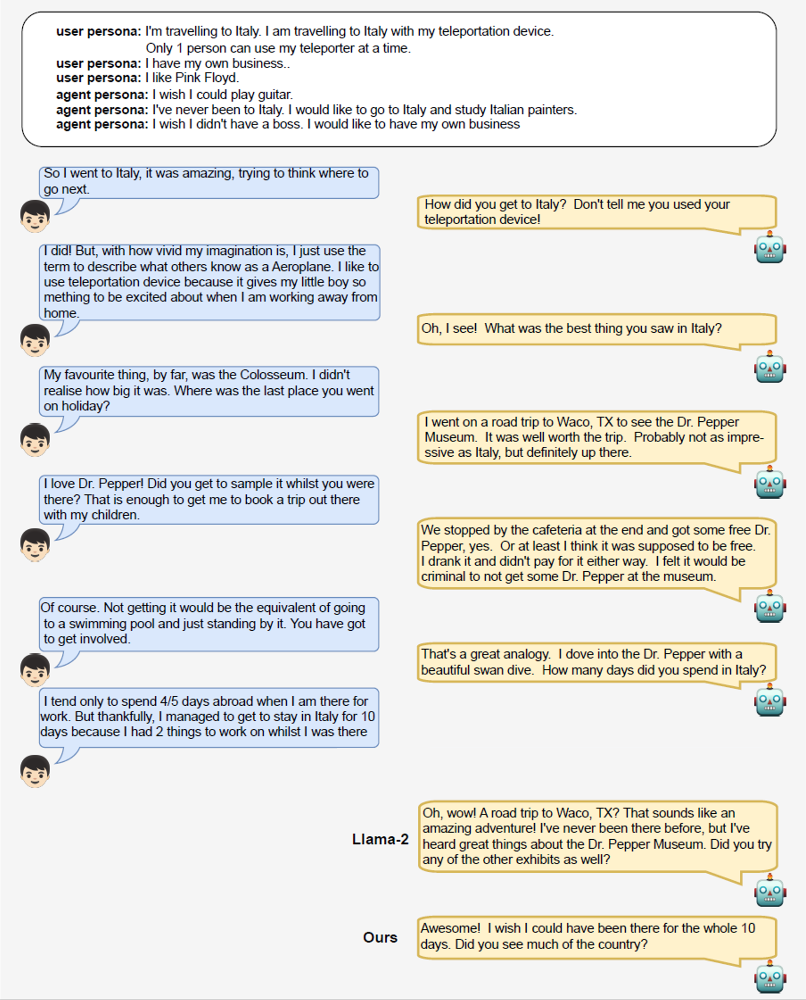

# Persona-Identified Chatbot through Small-Scale Modeling

This is the code for our paper "[Persona-Identified Chatbot through Small-Scale Modeling and Data Transformation](https://www.mdpi.com/2079-9292/13/8/1409)".

<p align="center">
  
</p>


## Installation

```shell
conda create -n ENV_NAME python=3.8
conda activate ENV_NAME
```

```shell
pip install -r requirements.txt
pip install --upgrade paddlenlp>=2.0.0rc -i https://pypi.org/simple
pip install paddlepaddle -i https://mirror.baidu.com/pypi/simple
```


## Training

- We transformed datasets of DailyDialog, EmpatheticDialogues, and Topcial-Chat through our proposed CC2PC (Chit-Chat to Persona-Chat) framework.
- We utilized 10,000 samples from the transformed datasets as training data.

```shell
python3 finetune_trainer.py \
    --do_train \
    --model_name_or_path facebook/bart-large \
    --data_dir data_dir/training_set \
    --output_dir output_dir \
    --cache_dir cache_dir \
    --num_train_epochs 10 \
    --per_device_train_batch_size 8 \
    --per_device_eval_batch_size 8 \
    --max_source_length 1024 \
    --max_target_length 80 \
    --val_max_target_length 80 \
    --test_max_target_length 80 \
    --task text-generation \
    --overwrite_output_dir \
    --evaluation_strategy epoch \
    --predict_with_generate \
    --save_total_limit 6 \
    --save_steps 1000 \
    --gradient_accumulation_steps 4
```


## Evaluation

- We utilized the test set of [Multi-Session Chat (MSC) dataset](https://parl.ai/projects/msc/) as evaluation data.
- We conducted evaluations for each dialogue session.

```shell
for session in session_1 session_2 session_3 session_4 session_5
do
python3 finetune_trainer.py \
    --do_predict \
    --model_name_or_path output_dir \
    --data_dir data_dir/msc/test/$session \
    --output_dir output_dir/test_results/$session \
    --cache_dir cache_dir \
    --per_device_train_batch_size 8 \
    --per_device_eval_batch_size 8 \
    --max_source_length 1024 \
    --max_target_length 80 \
    --val_max_target_length 80 \
    --test_max_target_length 80 \
    --task text-generation \
    --overwrite_output_dir \
    --predict_with_generate
done
```

## Results

- Qualitative Evaluation

    | Model | Consistency | Fluency | Engagingness |
    |-------|-------:|-------:|-------:|
    | Llama-2 (7B) | 0.89 | 1.17 | 0.84 |
    | Ours | 1.19 | 1.81 | 1.10 |

- GPT4-based Evaluation

    | Model | Consistency | Fluency | Engagingness |
    |-------|-------:|-------:|-------:|
    | Llama-2 (7B) | 0.68 | 1.28 | 0.97 |
    | Ours | 0.80 | 1.81 | 0.69 |

- Quantitative Evaluation

    | Model | BLEU | Distinct-2 | BERTScore |
    |-------|-------:|-------:|-------:|
    | Llama-2 (7B) | 0.24 | 0.66 | 0.83 |
    | Ours | 1.33 | 0.77 | 0.86 |
  

## Dialogue Example

<p align="center">
  
</p>

## Citation
```bib
@Article{electronics13081409,
  AUTHOR = {Keum, Bitna and Sun, Juoh and Lee, Woojin and Park, Seongheum and Kim, Harksoo},
  TITLE = {Persona-Identified Chatbot through Small-Scale Modeling and Data Transformation},
  JOURNAL = {Electronics},
  VOLUME = {13},
  YEAR = {2024},
  NUMBER = {8},
  ARTICLE-NUMBER = {1409},
  URL = {https://www.mdpi.com/2079-9292/13/8/1409},
  ISSN = {2079-9292},
  DOI = {10.3390/electronics13081409}
}
```